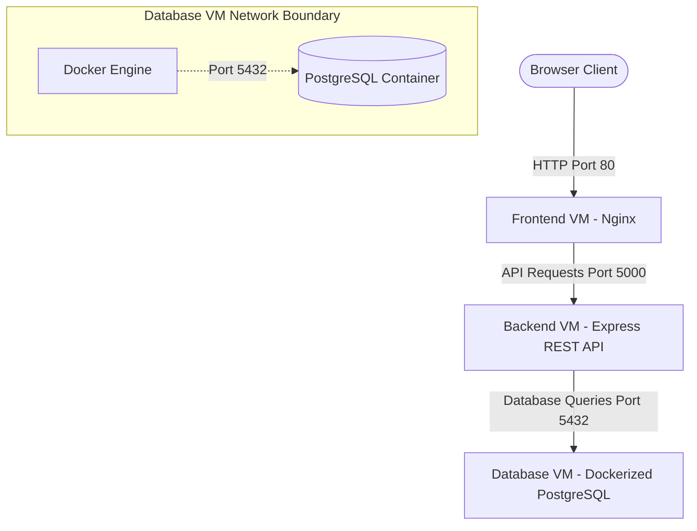

# ShutterScore (Letterboxd Clone) - 3-VM Web Application

ShutterScore is a premium, feature-rich social film logging and discovery web application styled after the iconic cinematic dark aesthetic of Letterboxd. 

This repository contains the full codebase structured for deployment across **three separate Virtual Machines (VMs)**:
1. **Database VM**: Runs a PostgreSQL database inside a Docker container.
2. **Backend VM**: Runs a Node.js + Express REST API.
3. **Frontend VM**: Serves a React + Vite Single Page Application using Nginx.

---

## 🏗️ Architecture & Network Diagram



---

## 🛠️ Deployment Instructions

### 1. Database VM Setup
This VM runs PostgreSQL in a Docker container to store users, movie metadata, and logs/reviews.

1. **Prerequisites**: Install Docker and Docker Compose on the VM:
   ```bash
   sudo apt-get update
   sudo apt-get install docker.io docker-compose -y
   ```
2. **Transfer Files**: Copy the `database/` folder containing `docker-compose.yml` and `init.sql` to the Database VM.
3. **Start the Database**:
   ```bash
   cd database
   sudo docker-compose up -d
   ```
4. **Verify Container Health**:
   ```bash
   sudo docker ps
   ```
   *Note: `init.sql` runs automatically on the first boot to create tables and seed movies (Parasite, Inception, Pulp Fiction, Spirited Away, etc.), default users, and sample reviews.*
5. **Firewall Rules**:
   - Expose port `5432` only to the IP address of the **Backend VM** (security best practice).

---

### 2. Backend VM Setup
This VM runs the Express API. It connects to the Database VM.

1. **Prerequisites**: Install Node.js v18+ and NPM:
   ```bash
   curl -fsSL https://deb.nodesource.com/setup_18.x | sudo -E bash -
   sudo apt-get install -y nodejs
   ```
2. **Transfer Files**: Copy the `backend/` folder to the Backend VM.
3. **Configure Environment Variables**:
   Create a `.env` file from the example:
   ```bash
   cd backend
   cp .env.example .env
   ```
   Edit `.env` and replace `localhost` in `DATABASE_URL` with the **Database VM's Private IP**:
   ```env
   PORT=5000
   DATABASE_URL=postgresql://shutter_user:shutter_secure_pass_2026@<DATABASE_VM_IP>:5432/shutterscore
   JWT_SECRET=shutter_score_secret_jwt_key_2026
   ```
4. **Launch Backend Service**:
   - **Option A (Bare Metal with PM2)**:
     ```bash
     npm install
     sudo npm install -g pm2
     pm2 start src/index.js --name shutterscore-backend
     ```
   - **Option B (Docker Container)**:
     ```bash
     sudo docker build -t shutterscore-backend .
     sudo docker run -d -p 5000:5000 --env-file .env --name shutterscore-api shutterscore-backend
     ```
5. **Firewall Rules**:
   - Expose port `5000` to allow traffic from the **Frontend VM** and client browsers.

---

### 3. Frontend VM Setup
This VM compiles the React application and serves the static files using Nginx.

1. **Prerequisites**: Install Node.js (v18+) for building the static assets.
2. **Transfer Files**: Copy the `frontend/` folder to the Frontend VM.
3. **Configure Environment Variables**:
   Create a `.env.production` file:
   ```bash
   cd frontend
   touch .env.production
   ```
   Define the backend REST API URL pointing to the **Backend VM's Public IP**:
   ```env
   VITE_API_URL=http://<BACKEND_VM_PUBLIC_IP>:5000
   ```
4. **Compile and Build**:
   ```bash
   npm install
   npm run build
   ```
   This generates a static production folder inside `dist/`.
5. **Serve via Nginx**:
   Install Nginx:
   ```bash
   sudo apt-get install nginx -y
   ```
   Copy the build assets and configure Nginx:
   ```bash
   sudo cp -r dist/* /var/share/nginx/html/
   # Copy nginx.conf configuration to enable routing redirects
   sudo cp nginx.conf /etc/nginx/sites-available/default
   sudo systemctl restart nginx
   ```
   *Alternatively, you can build and run it using the multi-stage Dockerfile*:
   ```bash
   sudo docker build --build-arg VITE_API_URL=http://<BACKEND_VM_PUBLIC_IP>:5000 -t shutterscore-frontend .
   sudo docker run -d -p 80:80 --name shutterscore-web shutterscore-frontend
   ```
6. **Firewall Rules**:
   - Expose port `80` (HTTP) and `443` (HTTPS) to the public internet.

---

## 💻 Local Development & Single-Command Test

If you want to run and test the complete stack on your local machine using Docker:

1. Clone or navigate to the project root directory.
2. Run the Docker Compose orchestration:
   ```bash
   docker-compose up -d --build
   ```
3. Open your browser and navigate to:
   - **Frontend**: [http://localhost:8080](http://localhost:8080)
   - **Backend API**: [http://localhost:5000](http://localhost:5000)
   - **Backend Health Check**: [http://localhost:5000/health](http://localhost:5000/health)

---

## 🗝️ Default Seed Credentials

For manual testing, the database has been seeded with three default users, all sharing the password `password123`:
1. `cinephile99` (Email: `cinephile99@shutterscore.com`)
2. `filmgirl` (Email: `filmgirl@shutterscore.com`)
3. `shutter_admin` (Email: `admin@shutterscore.com`)
