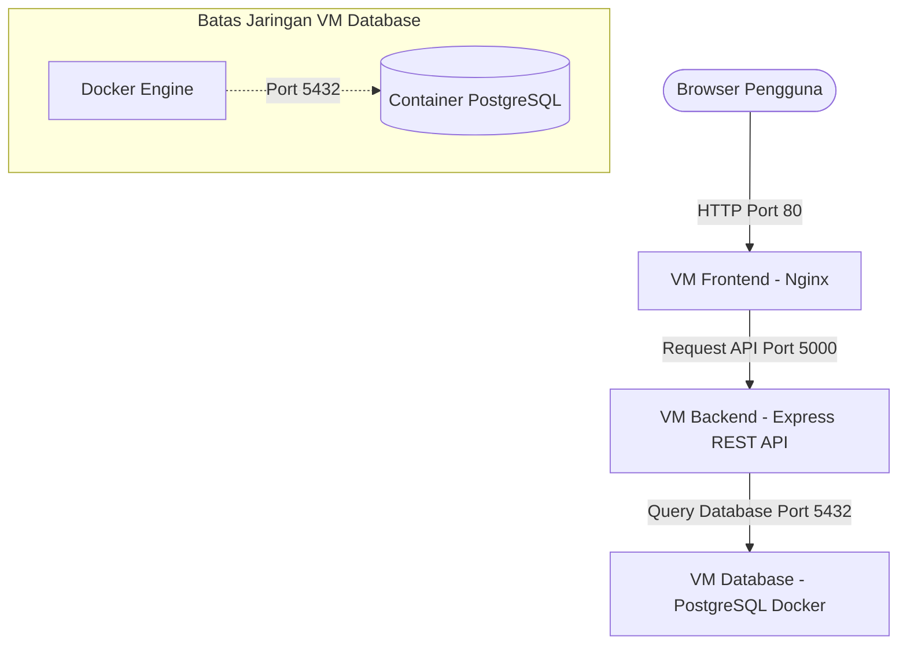

# ShutterScore (Kloningan Letterboxd) - Web App 3-VM

Halo! Selamat datang di **ShutterScore**. Ini adalah aplikasi web tempat kamu bisa mencatat, memberi rating, dan menemukan film-film menarik layaknya aplikasi Letterboxd. Aplikasi ini dirancang dengan gaya *dark aesthetic* yang keren dan elegan.

Proyek ini dibuat agar bisa dijalankan pada **tiga Virtual Machine (VM)** atau server yang terpisah, yaitu:
1. **VM Database**: Tempat menyimpan semua data (menggunakan PostgreSQL di dalam Docker).
2. **VM Backend**: Otak dari aplikasi ini, yang memproses data dari dan ke database (menggunakan Node.js + Express).
3. **VM Frontend**: Tampilan antarmuka (User Interface) yang akan dilihat oleh pengguna (menggunakan React + Vite dan Nginx).

---

## 🏗️ Gambaran Arsitektur & Jaringan



---

## 🛠️ Panduan Instalasi (Deployment)

Berikut adalah panduan langkah demi langkah untuk menjalankan aplikasi ini di server atau VM kamu.

### 1. Pengaturan VM Database
VM ini bertugas menyimpan data pengguna, info film, dan ulasan.

1. **Persiapan**: Pastikan Docker dan Docker Compose sudah terinstal di VM ini.
   ```bash
   sudo apt-get update
   sudo apt-get install docker.io docker-compose -y
   ```
2. **Pindahkan File**: Salin folder `database/` (yang berisi `docker-compose.yml` dan `init.sql`) ke VM ini.
3. **Jalankan Database**:
   ```bash
   cd database
   sudo docker-compose up -d
   ```
4. **Cek Status**: Pastikan database sudah berjalan dengan perintah:
   ```bash
   sudo docker ps
   ```
   *Catatan: Saat pertama kali dijalankan, sistem akan otomatis membuat tabel dan mengisi beberapa data awal seperti film (Parasite, Inception, dll) dan beberapa pengguna contoh.*
5. **Keamanan (Firewall)**:
   - Buka (expose) port `5432` **hanya** untuk IP address milik **VM Backend**. Jangan dibuka untuk publik!

---

### 2. Pengaturan VM Backend
VM ini memproses logika aplikasi dan menghubungkan Frontend ke Database.

1. **Persiapan**: Instal Node.js (versi 18 atau lebih baru) dan NPM.
   ```bash
   curl -fsSL https://deb.nodesource.com/setup_18.x | sudo -E bash -
   sudo apt-get install -y nodejs
   ```
2. **Pindahkan File**: Salin folder `backend/` ke VM Backend.
3. **Atur Environment Variables (Variabel Lingkungan)**:
   Buat file `.env` dari file contoh yang sudah disediakan:
   ```bash
   cd backend
   cp .env.example .env
   ```
   Buka file `.env` dan ubah tulisan `localhost` pada `DATABASE_URL` menjadi **IP Private milik VM Database**:
   ```env
   PORT=5000
   DATABASE_URL=postgresql://shutter_user:shutter_secure_pass_2026@<IP_VM_DATABASE>:5432/shutterscore
   JWT_SECRET=shutter_score_secret_jwt_key_2026
   ```
4. **Jalankan Backend**:
   Kamu bisa memilih salah satu dari dua cara berikut:
   - **Cara A (Langsung menggunakan PM2)**:
     ```bash
     npm install
     sudo npm install -g pm2
     pm2 start src/index.js --name shutterscore-backend
     ```
   - **Cara B (Menggunakan Docker)**:
     ```bash
     sudo docker build -t shutterscore-backend .
     sudo docker run -d -p 5000:5000 --env-file .env --name shutterscore-api shutterscore-backend
     ```
5. **Keamanan (Firewall)**:
   - Buka port `5000` agar bisa diakses oleh **VM Frontend** dan aplikasi browser.

---

### 3. Pengaturan VM Frontend
VM ini menampilkan halaman web (tampilan visual) ke pengguna.

1. **Persiapan**: Instal Node.js (versi 18+) untuk melakukan proses "build".
2. **Pindahkan File**: Salin folder `frontend/` ke VM Frontend.
3. **Atur Environment Variables (Variabel Lingkungan)**:
   Buat file `.env.production`:
   ```bash
   cd frontend
   touch .env.production
   ```
   Isi file tersebut dengan URL publik dari **VM Backend**:
   ```env
   VITE_API_URL=http://<IP_PUBLIK_VM_BACKEND>:5000
   ```
4. **Kompilasi (Build)**:
   Ubah kode React menjadi file statis yang siap ditampilkan:
   ```bash
   npm install
   npm run build
   ```
   Folder `dist/` akan muncul dan berisi file web yang sudah siap.
5. **Tampilkan Menggunakan Nginx**:
   Instal Nginx (server web ringan):
   ```bash
   sudo apt-get install nginx -y
   ```
   Pindahkan file statis tadi ke Nginx:
   ```bash
   sudo cp -r dist/* /var/share/nginx/html/
   sudo cp nginx.conf /etc/nginx/sites-available/default
   sudo systemctl restart nginx
   ```
   *Atau, jika ingin menggunakan Docker, kamu bisa menjalankan perintah ini:*
   ```bash
   sudo docker build --build-arg VITE_API_URL=http://<IP_PUBLIK_VM_BACKEND>:5000 -t shutterscore-frontend .
   sudo docker run -d -p 80:80 --name shutterscore-web shutterscore-frontend
   ```
6. **Keamanan (Firewall)**:
   - Buka port `80` (HTTP) dan `443` (HTTPS) agar aplikasi bisa diakses oleh siapa saja di internet.

---

## 💻 Cara Menjalankan Secara Lokal (Untuk Percobaan)

Jika kamu ingin mencoba menjalankan keseluruhan aplikasi di komputermu sendiri (tanpa VM), kamu cukup menggunakan Docker Compose:

1. Buka terminal di folder utama proyek ini.
2. Jalankan perintah:
   ```bash
   docker-compose up -d --build
   ```
3. Buka browser dan akses:
   - **Frontend (Tampilan)**: [http://localhost:8080](http://localhost:8080)
   - **API Backend**: [http://localhost:5000](http://localhost:5000)

---

## 🗝️ Akun Percobaan (Default)

Kami sudah menyiapkan beberapa akun yang bisa langsung kamu gunakan untuk mencoba login. Semua akun ini memiliki password yang sama, yaitu: `password123`

1. Username: `cinephile99` (Email: `cinephile99@shutterscore.com`)
2. Username: `filmgirl` (Email: `filmgirl@shutterscore.com`)
3. Username: `shutter_admin` (Email: `admin@shutterscore.com`)

Selamat mencoba!
